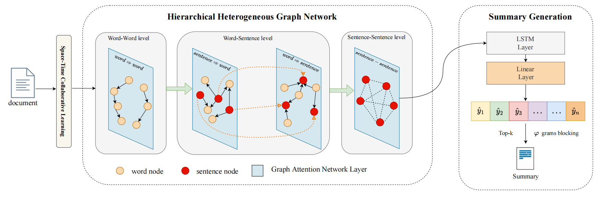

  <h3 align="center"><strong>[DISPLAYS] HHGraphSum: Hierarchical Heterogeneous Graph Learning for Extractive Document Summarization</strong></h3>

  <p align="center">
    <span>Pengyi Hao<sup>*1</sup>,</span>
    <a href="https://devin100086.github.io/">Cunqi Wu</a><sup>*1</sup>,
    <span>Cong Bai<sup>**1</sup>,
    <br>
    <sup>*</sup>Equal contribution.
    <sup>**</sup>Corresponding author.
    <br>
    <sup>1</sup>Zhejiang University of Technology	
 <h3 align="center"><a href="https://www.sciencedirect.com/science/article/pii/S0141938224002488?dgcid=coauthor">Paper</a></h3>
      
## Abstract 

Extractive summarization aims to select important sentences from the document to generate a summary. However, current extractive document summarization methods fail to fully consider the semantic information among sentences and the various relations in the entire document. Therefore, a novel end-to-end framework named hierarchical heterogeneous graph learning for document summarization (HHGraphSum) is proposed in this paper. In this framework, a hierarchical heterogeneous graph is constructed for the whole document, where the representation of sentences is learnt by several levels of graph neural network. The combination of single- direction message passing and bidirectional message passing helps graph learning obtain effective relations among sentences and words. For capturing the rich semantic information, space-time collaborative learning is designed to generate the primary features of sentences which are enhanced in graph learning. For generating a less redundant and more precise summary, a LSTM based predictor and a blocking strategy are explored.Evaluations both on a single-document dataset and a multi-document dataset demonstrate the effectiveness of the HHGraphSum.The code of HHGraphSum is available on Github: https://github.com/Devin100086/HHGraphSum



## News

- [11/8] :tada: Congratulation! our paper has been accepted for publication in DISPLAYS.
- [4/13] :fire:We have released **HHGraphSum** code.

## Installation

Our environment has been tested on Linux, CUDA 11.8 with one 2080Ti.

1. Clone our repo and create conda environment

   ```shell
   git clone https://github.com/Devin100086/HHGraphSum.git && cd HHGraphSum
   
   # You  pip environment
   pip install torch==2.0.1+cu118 torchvision==0.15.2+cu118 --extra-index-url https://download.pytorch.org/whl/cu118
   pip install  dgl -f https://data.dgl.ai/wheels/torch-2.1/cu118/repo.html
   
   ```

2. Download the datasets and pretrained model

   - [CNNDM](https://cs.nyu.edu/~kcho/DMQA/)
   - [MultiNews](https://github.com/Alex-Fabbri/Multi-News)
   - [Pretrained model Glove](https://apache-mxnet.s3.cn-north-1.amazonaws.com.cn/gluon/embeddings/glove/glove.42B.300d.zip)

3. prepare the data and train the model

   ```shell
      sh bash/PrepareDataset.sh
      sh bash/train.sh
   ```

4. prepare the data and train the model
   ```shell
   sh bash/test.sh
   ```

## Acknowledgements
This work is partially supported by National Natural Science Foundation of China under Grant No. U20A20196, and Zhejiang Province
Natural Science Foundation under Grant No. LR21F020002.

## Reference
 ```
@article{hao2024hhgraphsum,
  title={HHGraphSum: Hierarchical heterogeneous graph learning for extractive document summarization},
  author={Hao, Pengyi and Wu, Cunqi and Bai, Cong},
  journal={Displays},
  pages={102884},
  year={2024},
  publisher={Elsevier}
}
 ```

